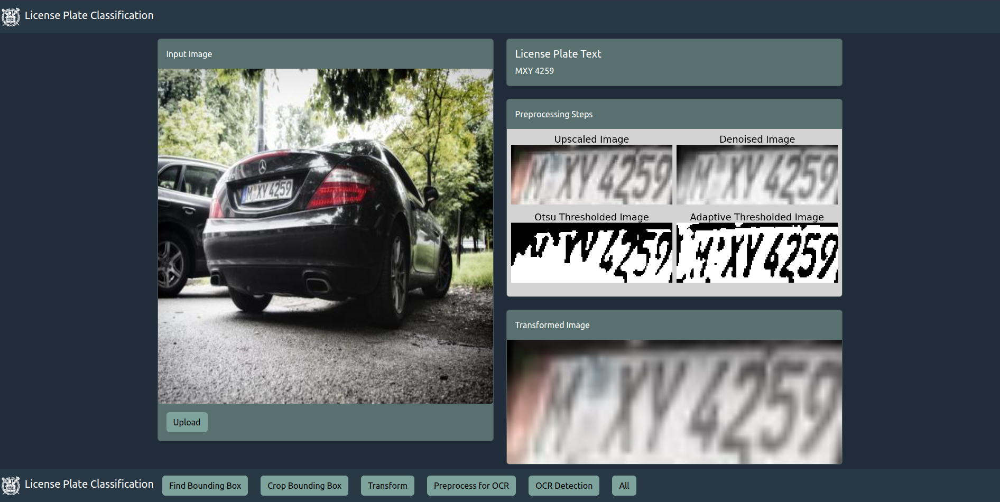

# SNU Computer Vision Project

## Setup Conda Environment

```bash
conda create -f dev-environment.yml
```

## Download Data

Download the dataset from [here](https://universe.roboflow.com/samrat-sahoo/license-plates-f8vsn) in the Yolov8 format and put the content into the `License-Plates-5` directory.

## Train

You can train the classifier using the provided jupyter notebook `training.ipynb`.

In order to finetune yolo, you need to provide the yolo model as `yolov5s.pt`.

The repository contains the fine-tuned model as `finetuned-model.pt`.

## Webapp

The repository contains a webapp for demonstration puroposes.
The backend files can be found in the `licenseplates` module. It is built upon fastapi.
The frontend is built upon react and can be found in `licensenplates-fe` directory.

You can start frontend and backend using `docker compose`:

```bash
docker compose up
```

The webapp is then available at `http://localhost:3000`.

### Webapp Demo

In the following, you can see how the webapp looks like:



## Manual Prediction

You can also use the `predict.py` script to manual predict a license plate:

```bash
python predict.py
```
